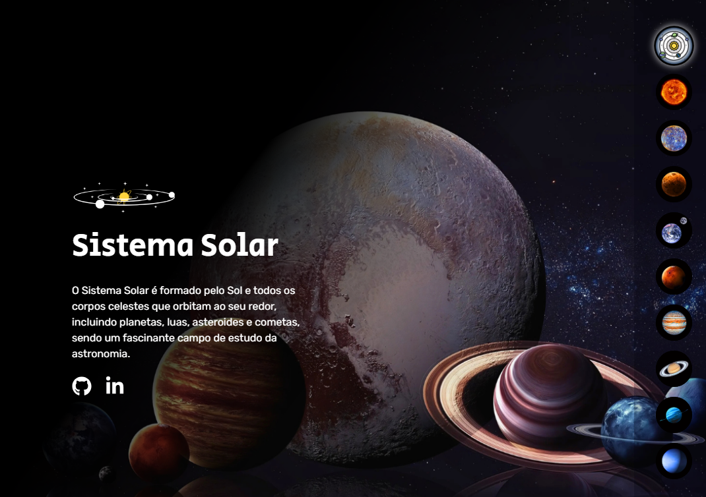

# 🌍🌌 O Sistema Solar - Seleção de Planetas Interativos ☀️🪐

Este projeto é uma homenagem ao universo fascinante do **Sistema Solar**, onde os usuários podem explorar visualmente os planetas e suas características de forma **interativa** e **educativa**. Desenvolvido com **HTML**, **CSS** e **JavaScript**, o projeto proporciona uma experiência envolvente e intuitiva, ideal para quem deseja aprender mais sobre os astros que compõem o nosso sistema solar.

> Este projeto foi inspirado em desafios de desenvolvimento web e prática com DOM em **JavaScript**, com foco em interação visual e aprendizado lúdico.

---

## 📌 Acesse o Projeto

- 🔗 **Deploy (GitHub Pages)**: [visualizar o projeto paulaPSOx/o-sistema-solar](https://paulapsox.github.io/o-sistema-solar/)
- 📁 **Repositório no GitHub**: [https://github.com/paulaPSOx/o-sistema-solar](https://github.com/paulaPSOx/o-sistema-solar)

---

## ✨ Objetivo

Oferecer uma forma visual e interativa de conhecer os planetas do **Sistema Solar**, destacando suas imagens e características com transições suaves e organização clara.

---

## 🛠️ Tecnologias Utilizadas

- **HTML**: Estruturação dos elementos e seções da página.
- **CSS**: Estilização com temas espaciais, cores vibrantes e responsividade.
- **JavaScript**: Lógica de interação, troca de planetas e realce visual.

---

## 📁 Estrutura de Pastas

```
├── src
│   ├── css
│   │   └── style.css
│   ├── imagens
│   │   ├── planetas
│   │   │   ├── mercurio.png
│   │   │   ├── venus.png
│   │   │   ├── terra.png
│   │   │   └── ... .png
│   │   ├── fundo
│   │   │   └── ... .png
│   │   ├── botao
│   │   │   └── ... .png
│   │   ├── icones
│   │   │   └── ... .svg
│   │   ├── logotipo
│   │   │   └── logo-sistema-solar.png
│   │   └── wallpaper
│   │       └── ... .png
│   ├── js
│   │   └── index.js
├── index.html
├── LICENSE
└── README.md
```

---

## 📄 Descrição dos Arquivos

- `style.css`: Estilos visuais com tema espacial e responsividade.
- `index.js`: Código responsável por interação com a página, troca de planetas e efeitos visuais.
- `index.html`: Página principal que estrutura os conteúdos e elementos.
- `/imagens/planetas`: Contém as imagens de cada planeta do sistema solar.
- `/imagens/fundo`: Imagem de fundo estrelado para o espaço.
- `/imagens/botao`: Ícones ou imagens de botões utilizados na interface.
- `/imagens/icones`: Ícones temáticos do sistema solar.
- `/imagens/logotipo`: Logotipo do projeto.
- `/imagens/wallpaper`: Papéis de parede ou fundos decorativos espaciais.

---

## 🌟 Funcionalidades

- ✅ Seleção de planetas com troca visual destacada.
- ✅ Interface responsiva com estilo visual espacial.
- ✅ Efeitos de transição para uma navegação mais fluida.
- ✅ Apresentação educativa e atrativa dos planetas.

---

## 📸 Capturas de Tela



---

## 🚀 Como Usar

1. Clone este repositório:
   ```bash
   git clone https://github.com/paulaPSOx/o-sistema-solar
   ```

2. Navegue até a pasta do projeto:
   ```bash
   cd o-sistema-solar
   ```

3. Abra o arquivo `index.html` no seu navegador preferido.

---

## 🧪 Testes

- ✅ Teste a seleção de cada planeta.
- ✅ Verifique se todas as imagens estão aparecendo corretamente.
- ✅ Confira a responsividade em diferentes tamanhos de tela.

---

## 🌠 Melhorias Futuras

✨ Adicionar informações sobre os planetas ao lado de suas imagens.
✨ Inserir trilha sonora ou efeitos sonoros espaciais.
✨ Criar um modo noturno e um modo telescópio.
✨ Simulação de órbitas com animações.

---

## 📝 Licença

Distribuído sob a licença **MIT**. Consulte o arquivo [LICENSE](./LICENSE) para mais detalhes.

---

## 🙏 Agradecimentos

Agradeço à comunidade de desenvolvedores, educadores e entusiastas do espaço que inspiraram este projeto!

---

✨ Esperamos que você curta essa jornada pelos mistérios do **Sistema Solar**! 🌠
